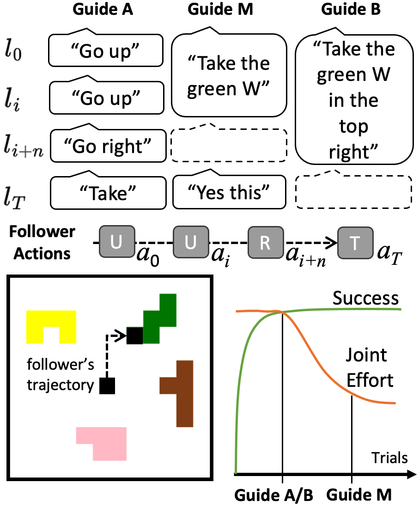
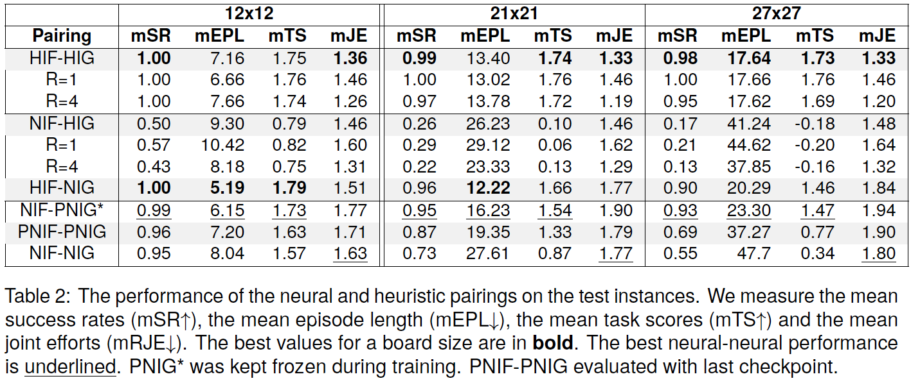

# Sharing the Cost of Success: A Game for Evaluating and Learning Collaborative Multi-Agent Instruction Giving and Following Policies

We propose to use a **Co**llaborative **G**ame of **R**eferential and **I**nteractive language with **P**entomino pieces
(**CoGRIP**) as a controllable setting to evaluate and learn neural policies for the aspect of cost sharing a
multi-agent setting. In CoGRIP two players are forced to work together because of their asymmetry in knowledge and
skill. A guide uses language utterances to instruct a follower to select a specific puzzle piece. The guide can provide
utterances but cannot move the gripper. The follower can move the gripper but is not allowed to provide an utterance.
The players receive a score after playing that represents their success and the effort spent for completion.

We frame this task as a reinforcement learning problem with sparse rewards where the reward also incorporates the 
communicative effort. We bootstrap the learning of follower and guide policies with respective heuristic partners in
this setting. And then use the pre-trained policies to adapt to each other. Our results show that the neural partners 
in a multi-agent setting indeed strive towards a presumably more human-like strategy when effort matters.

<p style="text-align: center;">

</p>
<p style="text-align: center;">
<em>A guide and a follower observe the board with the pieces and the follower's gripper (the black dot). 
An optimal trajectory of actions for the follower would be: up (U), up, right (R), and take (T). 
The best strategy for the guide lies assumably in the middle (M) of the extremes (A/B) where the 
guide refers to a piece initially and stays silent at until confirming the follower's 
choice later. This strategy shares the cost for success between both.</em>
</p>

## Abstract

> In collaborative goal-oriented settings, the participants are not only interested in achieving a successful outcome,
> but do also implicitly negotiate the effort they put into the interaction (by adapting to each other). In this work, we
> propose a challenging interactive reference game that requires two players to coordinate on vision and language
> observations. The learning signal in this game is a score (given after playing) that takes into account the achieved
> goal and the players' assumed efforts during the interaction. We show that a standard Proximal Policy Optimization (PPO)
> setup achieves a high success rate when bootstrapped with heuristic partner behaviors that implement insights from the
> analysis of human-human interactions. And we find that a pairing of neural partners indeed reduces the measured joint
> effort when playing together repeatedly. However, we observe that in comparison to a reasonable heuristic pairing there
> is still room for improvement -- which invites further research in the direction of cost-sharing in collaborative
> interactions.

## Results

<p style="text-align: center;">

</p>

## Cite

```
@inproceedings{sadler-2024-cost-sharing,
    title = "Sharing the Cost of Success: A Game for Evaluating and Learning Collaborative Multi-Agent Instruction Giving and Following Policies",
    author = "Sadler, Philipp, Hakimov, Sherzod and Schlangen, David",
    booktitle = "Proceedings of the 2024 Joint International Conference on Computational Linguistics, Language Resources and Evaluation (LREC-COLING 2024)",
    month = "may",
    year = "2024",
    address = "Torino, Italy",
    publisher = "European Language Resources Association",
}
```

# Reproduction

This section covers a step-by-step guide of how to use the provided scripts and sources.

## Preparation

Checkout the repository

Install the requirements:

```
pip install -r requirements.txt
```

Install the font (if on Ubuntu):

```
sudo ./install_font.sh
```

For all commands we assume that you are in the top level project directory and executed in before:

```
source prepare_path.sh
```

## Data Generation

Selection of pieces is stored to `splits.json`. A new one can be generated with

```
python3 neumad/tasks/generate_splits.py
```

Tasks are stored to `tasks-didact-{map-size}.json` files.

New tasks can be generated with

```
python3 neumad/tasks/generate_tasks.py
```

## Data format: Tasks

This file contains the tasks for all splits as a dictionary.

```
{
 "train": [Task],
 "val": [Task],
 "test": [Task],
 "holdout": [Task],
}
```

## Data format: Task

```
{
 "grid_config": {"width": 12, "height": 12, "move_step": 1, "prevent_overlap": true}, 
 "max_steps": 30, 
 "target_piece": {
    "piece_symbol": ["blue", "W", "center", 0], 
    "piece_obj": {
        "id_n": 0, 
        "type": "W",
         "x": 6, 
         "y": 4, 
         "rotation": 0, 
         "color": ["blue", "#0000ff", [0, 0, 255]], 
         "block_matrix": [
            [1, 0, 0, 0, 0], 
            [1, 1, 0, 0, 0], 
            [0, 1, 1, 0, 0], 
            [0, 0, 0, 0, 0],
            [0, 0, 0, 0, 0]]
        }
    }, 
 "pieces": [
    {"piece_symbol": ["blue", "W", "center", 0],  "piece_obj": {<as above>}},
    {...},
    ... 
  ]
}
```

## Training

The models will be saved to `save_models` in the project folder.

Note: At each episode the follower starts at a random coordinate. The encoded language-conditioned observations from the
partial and peripheral view are fused by addition and then given to the recurrent policy.  

### Neural Follower - Heuristic Guide (NIF-HIG)

The neural follower is bootstrapped with a heuristic guide partner. These runs are prepared in a script file.

```
./follower_heuristic_all.sh
```

which basically calls a variant of 

```
python3 neumad/agent_learn.py 12 didact full follower -F neural -S heuristic -SN r={1,4} -G {gpu} -T 10 -R {seed} 
```

### Heuristic Follower - Neural Guide (HIF-NIG)

The neural guide is bootstrapped with a heuristic follower partner. These runs are prepared in a script file.

```
./speaker_heuristic_all.sh
```

which basically calls a variant of 

```
python3 neumad/agent_learn.py 12 didact full speaker -F heuristic -FN cautiuous_c=99 -S neural -G {gpu} -T 10 -R {seed} 
```

### Neural Follower - Pre-trained Neural Guide (NIF-PNIG*)

The pre-trained neural guide is kept frozen so that the neural follower can learn to follow its strategy.

```
python3 neumad/agent_learn.py 12 didact full follower -F neural -S neural -SN pretrained -G {gpu} -T 10 -R {seed} 
```

Note: What `pretrained` refers to is hard-coded in the setting preparation.

### Pre-trained Neural Follower - Pre-trained Neural Guide (PNIF-PNIG)

In this multi-agent setting both players can adapt to each other. The players continue from pre-training checkpoints.

```
python3 neumad/agent_learn_ma.py 12 didact full -SN pretrained -FN pretrained -G {gpu} -T 10 -R {seed} 
```

Note: What `pretrained` refers to is hard-coded in the setting preparation.

### Neural Follower - Neural Guide (NIF-NIG)

In this multi-agent setting both players can adapt to each other. The players learn from scratch.

```
python3 neumad/agent_learn_ma.py 12 didact full -G {gpu} -T 10 -R {seed} 
```

## Evaluation

The evaluation outcome will be stored to the `results` folder.

Note: For evaluation the follower always starts in the center. The seed is only given to determine the checkpoint path.

### Heuristic Follower - Heuristic Guide (HIF-HIG)

For this pairing there is only an evaluation procedure, because there are no parameters to be learnt.

```
python3 neumad/agent_eval_heuristic_matrix.py
```


### Neural Follower - Heuristic Guide (NIF-HIG)

The pre-trained neural follower is evaluated with its heuristic guide partner. These runs are prepared in a script file.

```
./follower_heuristic_eval_all.sh
```

which basically calls a variant of 

```
python3 neumad/agent_eval.py {val,test} {12,21,27} 12 didact full follower -F neural -S heuristic -SN r={1,4} -G {gpu} -R {seed} 
```

### Heuristic Follower - Neural Guide (HIF-NIG)

The pre-trained neural guide is evaluated with its heuristic follower partner. These runs are prepared in a script file.

```
./speaker_heuristic_eval_all.sh
```

which basically calls a variant of 

```
python3 neumad/agent_eval.py {val,test} {12,21,27} 12 didact full speaker -F heuristic -FN cautiuous_c=99 -S neural -G {gpu} -R {seed} 
```

### Neural Follower - Pre-trained Neural Guide (NIF-PNIG*)

The pre-trained neural follower is evaluated with its pre-trained neural guide.

```
python3 neumad/agent_eval.py {val,test} {12,21,27} 12 didact full follower -F neural -S neural -SN pretrained -G {gpu} -R {seed} 
```

Note: What `pretrained` refers to is hard-coded in the setting preparation.

### Pre-trained Neural Follower - Pre-trained Neural Guide (PNIF-PNIG)

The further adapted pre-trained neural players are evaluated with:

```
./neural_neural_eval_all.sh (with model="pretrained")
```

which basically calls a variant of 

```
python3 neumad/agent_eval_ma.py {val,test} {12,21,27} {additive-rnd,pretrained} -G {gpu} -R {seed} 
```

Note: What `pretrained` refers to is hard-coded in the setting preparation. 
Similarly, the file name used (`best_model` or `latest_eval_model`) is manually set in `agent_eval_ma.py`.

### Neural Follower - Neural Guide (NIF-NIG)

The neural players that adapt from scratch are evaluated with:

```
./neural_neural_eval_all.sh (with model="additive-rnd")
```

which basically calls a variant of 

```
python3 neumad/agent_eval_ma.py {val,test} {12,21,27} {additive-rnd,pretrained} -G {gpu} -R {seed} 
```

Note: The file name used (`best_model` or `latest_eval_model`) is manually set in `agent_eval_ma.py`.

## Compute the results

The results should be put into the following structure under the project root

```
results/
    |- TakePieceEnv/
        |- follower/
        |    |- tasks-didact-12-full/additive-rnd/
        |        |- pretrained
        |        |    |- 49184
        |        |    |    |- log_test_12_pretrained.txt
        |        |    |    |- log_test_21_pretrained.txt
        |        |    |    |- log_test_27_pretrained.txt
        |        |    |    |- progress_test_12_pretrained.json
        |        |    |    |- progress_test_21_pretrained.json
        |        |    |    |- progress_test_27_pretrained.json
        |        |    |- ...
        |        |- speaker_td=1_tt=1
        |        |    |- ...
        |        |- ...
        |- follower-ma/
        |    |- ...
        |- heuristic/
        |    |- ...
        |- speaker/
            |- ...
```

The results for the neural followers (NIF-HIG, NIF-PNIG*) are computed with:

```
notebooks/results_follower.ipynb
```

The results for the neural guides (HIF-NIG) are computed with:

```
notebooks/results_speaker.ipynb
```

The results for the heuristic pairing (HIF-HIG) are computed with:

```
notebooks/results_heuristic.ipynb
```

The results for the multi-agent pairings (NIF-NIG, PNIF-PNIG) are computed with:

```
notebooks/results_ma.ipynb
```

## Play the game

You can play with another player as the follower or the guide. For this have a look in `neumad/play_env.py`.

You can also watch the heuristics play together. For this have a look in `neumad/play_env_heuristic.py`.


## Record a gif

You can watch a pairing by recording episodes of play that will be stored to a gif. 

For this have a look in `neumad/watch_agent.py` and `neumad/watch_agent_ma.py`.

